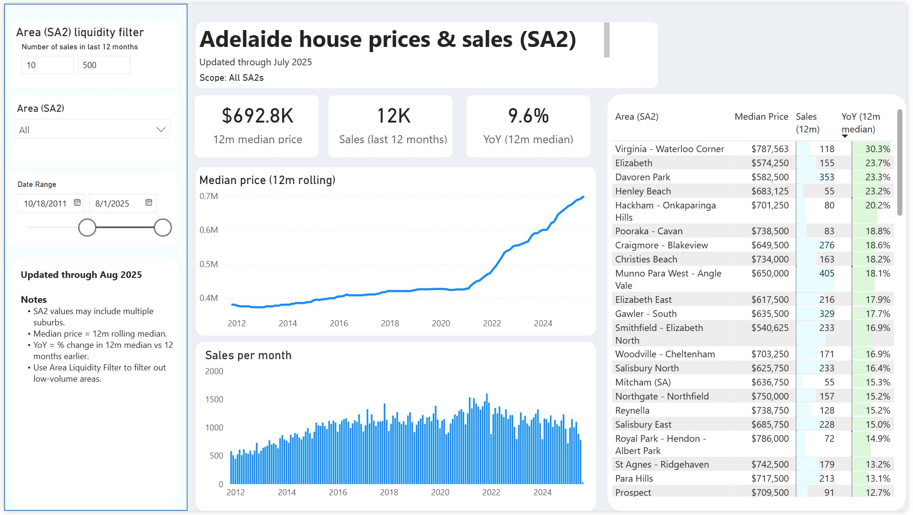
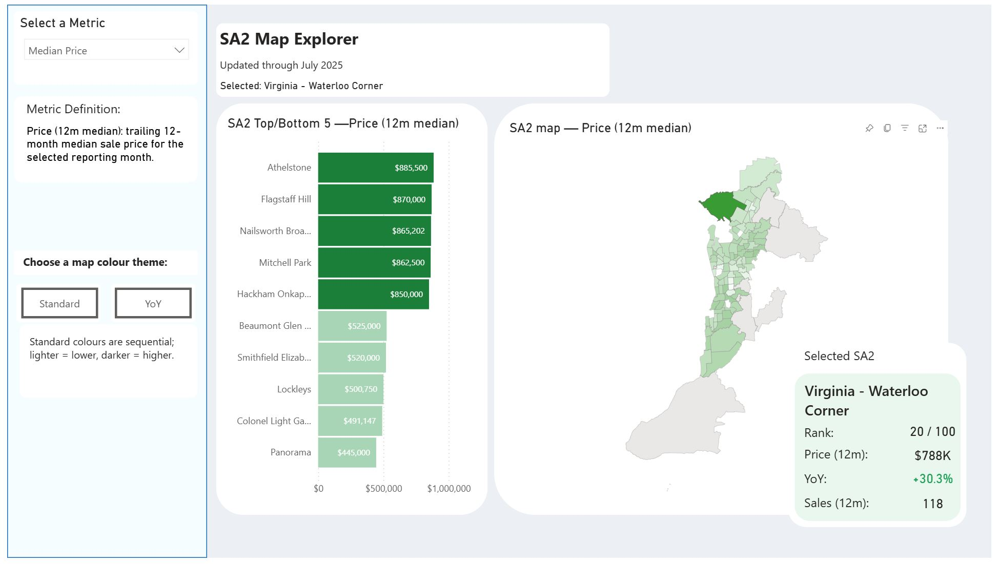
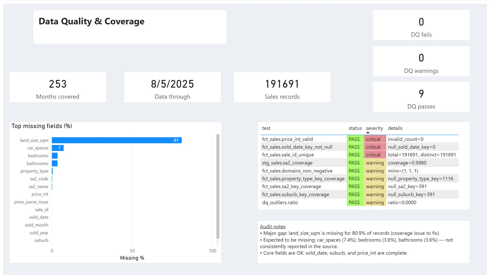

# Adelaide Housing Analytics Project (Power BI + DuckDB)

This is an Adelaide housing reporting project built in DuckDB and Power BI.

**1) Executive overview**



**2) SA2 explorer page** *(click image for short video)*

[](https://github.com/user-attachments/assets/735912fe-7d5c-4578-92df-899ef92d603a)

**3) Data quality audit page**



## Public vs private

Screenshots in this repo come from my **full private local build** (about 191k sales rows).

This public repo uses a **synthetic demo sample** (`data/public_sample/stg_sales_public.csv`) with the same schema and pipeline shape.  
So if you run it locally, your row counts and metrics will differ from my screenshot values.

## What’s inside

- DuckDB warehouse with `fct_sales` and dimensions
- Monthly marts for SA2, suburb, and Adelaide-wide trends
- DQ outputs for missingness, invalids, duplicates, freshness, and outliers
- Power BI pages for overview, map exploration, and DQ audit


## Key caveats

- The source data was capped at around `$900k` (max seen around `$919k`), so analysis using prices is limited to that range.
- Land size is sparse (~80% missing).

More details: `docs/caveats.md`

## What To Open First

- `screenshots/`
- `docs/project_summary.md`
- `transform/build_warehouse.py`
- `quality/build_dq.py`

## Quick Run (Demo)

```bash
pip install -r requirements.txt
python transform/generate_synthetic_sample.py
python transform/build_warehouse.py
python quality/build_dq.py
python quality/run_tests.py
```

Outputs are written to:
- `outputs/warehouse.duckdb`
- `outputs/public/*.csv`

## Repo Layout

- `transform/`: staging, SA2 join, warehouse + marts
- `quality/`: DQ tables and test report
- `docs/`: grain, lineage, caveats, metrics, project summary
- `data/public_sample/`: synthetic demo input
- `assets/maps/`: SA2 TopoJSON used for shape map
- `screenshots/`: report exports

## Next steps

- add scheduled refresh / orchestration
- run tests in CI before publishing outputs
- publish a Power BI Service version
- add freshness / DQ alerting